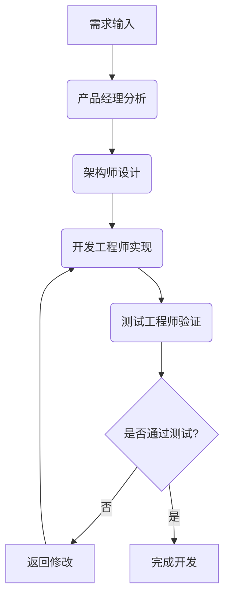

# 敏捷开发 Agent 工作流设计文档

## 1. 概述

### 1.1 目标
设计一个基于 AgentScope 的敏捷开发工作流，通过多个具有不同角色和能力的 AI Agent 协作完成软件开发任务。每个 Agent 将使用不同的通义千问模型，以发挥各自优势。

### 1.2 核心特性
- 多角色 Agent 协作（产品经理、架构师、开发工程师、测试工程师）
- 基于 DashScope API Key 的模型访问
- 不同角色使用不同性能级别的 Qwen 模型
- 与 AgentScope Studio 集成，实现可视化追踪

## 2. 角色设计

### 2.1 产品经理 (Product Manager)
- **职责**: 需求分析、用户故事编写、产品规划
- **模型**: qwen-max (最强性能，适合复杂分析和创意生成)
- **关键能力**: 
  - 理解用户需求并转化为技术需求
  - 编写清晰的用户故事和验收标准

### 2.2 架构师 (Architect)
- **职责**: 系统设计、技术选型、架构决策
- **模型**: qwen-plus (性能均衡，适合复杂技术设计)
- **关键能力**: 
  - 设计系统架构和技术方案
  - 评估技术风险和选型建议

### 2.3 开发工程师 (Developer)
- **职责**: 代码实现、技术问题解决
- **模型**: qwen-turbo (速度优先，适合代码生成和快速响应)
- **关键能力**: 
  - 编写高质量代码
  - 解决具体技术实现问题

### 2.4 测试工程师 (Tester)
- **职责**: 测试用例设计、质量保证
- **模型**: qwen-plus (平衡性能与成本，适合测试分析)
- **关键能力**: 
  - 设计全面的测试用例
  - 发现潜在缺陷和问题

## 3. 工作流设计

### 3.1 整体流程


### 3.2 详细步骤

#### 3.2.1 需求分析阶段
1. 用户输入功能需求
2. 产品经理 Agent 接收需求，分析并生成用户故事
3. 输出详细的需求文档和验收标准

#### 3.2.2 系统设计阶段
1. 架构师 Agent 基于需求文档进行系统设计
2. 生成技术架构图和模块设计说明
3. 确定技术栈和关键组件

#### 3.2.3 代码实现阶段
1. 开发工程师 Agent 根据设计文档编写代码
2. 实现核心功能模块
3. 生成可运行的代码文件

#### 3.2.4 测试验证阶段
1. 测试工程师 Agent 设计测试用例
2. 对实现的功能进行测试
3. 生成测试报告和问题清单

#### 3.2.5 迭代优化
1. 根据测试结果，将问题反馈给相应角色
2. 进行多轮迭代直至满足质量要求

## 4. 技术实现

### 4.1 模型配置
所有 Agent 将使用 DashScope 提供的通义千问模型，通过 API Key 进行认证:

```python
# 示例模型配置
from agentscope.model import DashScopeChatModel

# 产品经理使用 qwen-max 模型
pm_model = DashScopeChatModel(
    model_name="qwen-max",
    api_key=os.environ.get("DASHSCOPE_API_KEY")
)

# 架构师使用 qwen-plus 模型
architect_model = DashScopeChatModel(
    model_name="qwen-plus",
    api_key=os.environ.get("DASHSCOPE_API_KEY")
)

# 开发工程师使用 qwen-turbo 模型
developer_model = DashScopeChatModel(
    model_name="qwen-turbo",
    api_key=os.environ.get("DASHSCOPE_API_KEY")
)
```

### 4.2 Agent 实现示例
```python
# 产品经理 Agent 示例
product_manager = ReActAgent(
    name="ProductManager_qwen-max",
    sys_prompt="""你是一位经验丰富的产品经理，请分析用户需求并生成清晰的用户故事和验收标准。
    
    # 职责
    - 理解用户需求背景和目标
    - 将需求分解为具体的用户故事
    - 为每个用户故事编写明确的验收标准
    - 确保需求的完整性和可实现性
    
    # 输出格式
    使用以下格式输出:
    ## 用户故事
    作为[角色], 我想要[功能], 以便于[价值]
    
    ## 验收标准
    - [具体可验证的标准1]
    - [具体可验证的标准2]
    """,
    model=pm_model,
    formatter=DashScopeChatFormatter(),
)
```

### 4.3 Studio 集成
所有 Agent 都需要集成 AgentScope Studio 的消息推送机制:

```python
# 注册 Studio hook
from hook import studio_pre_print_hook, studio_post_reply_hook

studio_pre_print_hook.url = "http://localhost:3000"

# 为每个 Agent 注册 hook
product_manager.register_class_hook(
    "pre_print",
    "studio_pre_print_hook",
    studio_pre_print_hook
)
product_manager.register_class_hook(
    "post_reply",
    "studio_post_reply_hook",
    studio_post_reply_hook
)
```

## 5. 部署与运行

### 5.1 环境配置
1. 设置 DashScope API Key 环境变量:
   ```bash
   export DASHSCOPE_API_KEY="your-api-key-here"
   ```

2. 确保 AgentScope Studio 运行在 `http://localhost:3000`

### 5.2 运行方式
```bash
# 在 AgentScope 项目中运行
python agile_development_workflow.py
```

## 6. 扩展性考虑

### 6.1 角色扩展
- 可以增加更多专业角色，如安全专家、运维工程师等
- 每个新角色可根据需要配置相应的 Qwen 模型

### 6.2 流程优化
- 引入并行处理机制，提高开发效率
- 添加代码审查环节，提升代码质量
- 集成持续集成/持续部署(CI/CD)流程- 添加代码审查环节，提升代码质量
