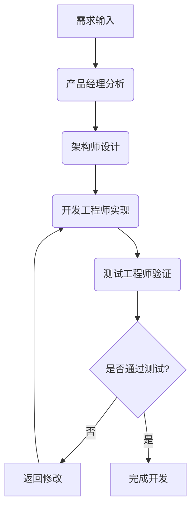

# 敏捷开发 Agent 工作流

## 简介

这是一个基于 AgentScope 的敏捷开发工作流实现，通过多个具有不同角色和能力的 AI Agent 协作完成软件开发任务。每个 Agent 使用不同的通义千问模型，以发挥各自优势。

## 角色设计

1. **产品经理 (ProductManager_qwen-max)**
   - 职责：需求分析、用户故事编写、产品规划
   - 模型：qwen-max (最强性能，适合复杂分析和创意生成)

2. **架构师 (Architect_qwen-plus)**
   - 职责：系统设计、技术选型、架构决策
   - 模型：qwen-plus (性能均衡，适合复杂技术设计)

3. **开发工程师 (Developer_qwen-turbo)**
   - 职责：代码实现、技术问题解决
   - 模型：qwen-turbo (速度优先，适合代码生成和快速响应)

4. **测试工程师 (Tester_qwen-plus)**
   - 职责：测试用例设计、质量保证
   - 模型：qwen-plus (平衡性能与成本，适合测试分析)

## 工作流



## 运行方式

1. 设置环境变量：
   ```bash
   export DASHSCOPE_API_KEY="your-api-key-here"
   ```

2. 确保 AgentScope Studio 运行在 `http://localhost:3000`

3. 运行程序：
   ```bash
   python main.py
   ```

## 项目结构

- `main.py`: 主程序文件，包含工作流逻辑和 Agent 实现

## 扩展性

- 可以增加更多专业角色，如安全专家、运维工程师等
- 每个新角色可根据需要配置相应的 Qwen 模型
- 可引入并行处理机制，提高开发效率
- 可添加代码审查环节，提升代码质量
- 可集成持续集成/持续部署(CI/CD)流程